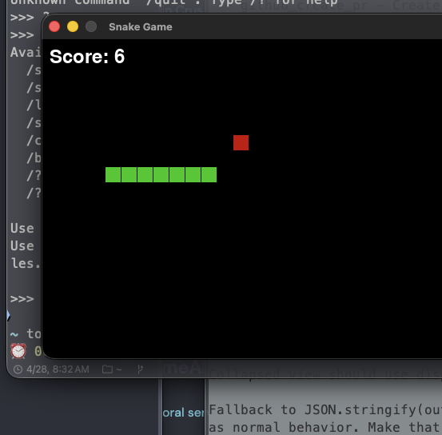
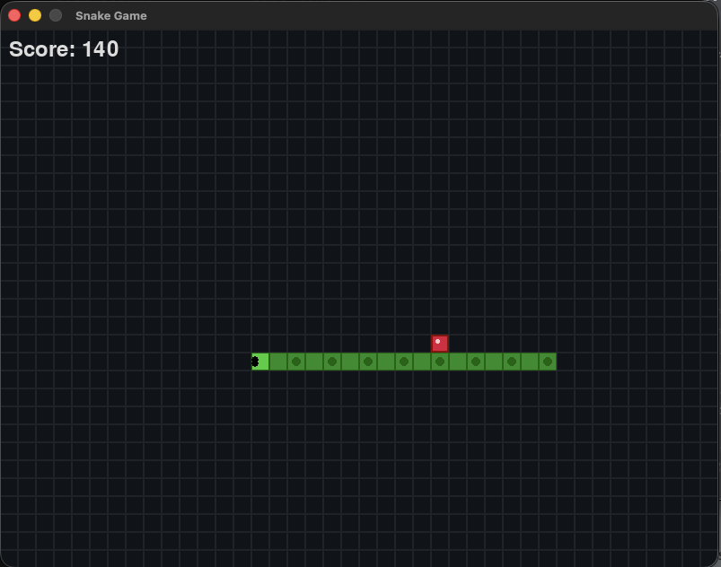
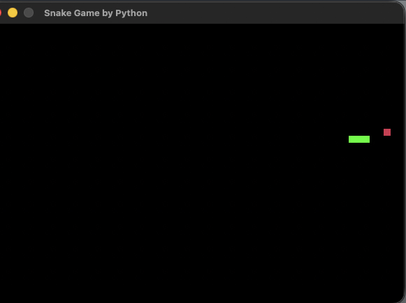
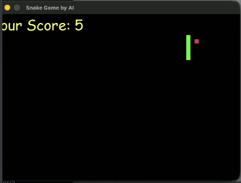
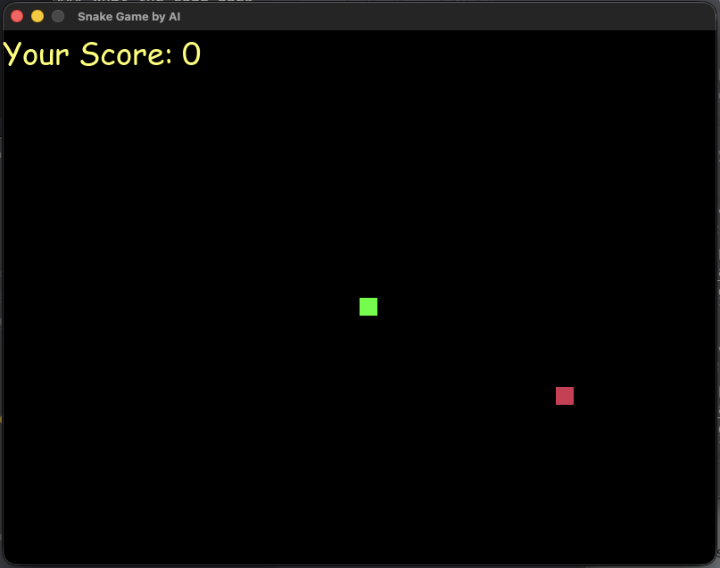
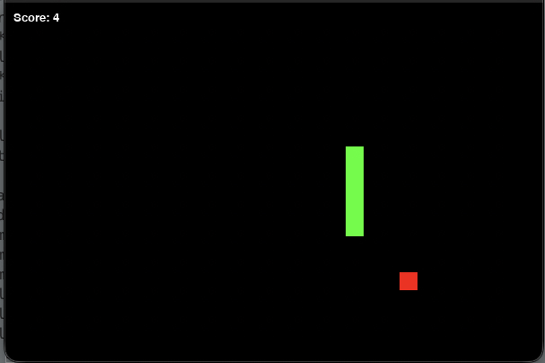

Testing local coder models. `qwen3-coder:30b` was the long-time winner, but Poolside's fresh `laguna-xs.2` (released 2026-04-28) beats it on raw speed. Quality TBD once I run laguna's snake.

# qwen3.6:27b-mlx-bf16

```
⏰ 21:13:40 ❯ ollama run qwen3.6:27b-mlx-bf16 --verbose
>>> oi
>>> .
>>> .
>>> .
Oi! 😊 Como posso te ajudar hoje?

total duration:       52.5540965s
load duration:        13.863198s
prompt eval count:    11 token(s)
prompt eval duration: 8.221275625s
prompt eval rate:     1.34 tokens/s
eval count:           266 token(s)
eval duration:        30.467718958s
eval rate:            8.73 tokens/s
>>> give me a snake pygame please
Thinking...
.
.
.
total duration:       6m45.272239583s
load duration:        51.41625ms
prompt eval count:    37 token(s)
prompt eval duration: 1.441874125s
prompt eval rate:     25.66 tokens/s
eval count:           3578 token(s)
eval duration:        6m43.777399458s
eval rate:            8.86 tokens/s
```

- Full log: [logs/qwen3.6-27b-mlx-bf16.log](logs/qwen3.6-27b-mlx-bf16.log)
- Snake code: [output/snake-pygame/qwen3.6-27b-mlx-bf16.py](output/snake-pygame/qwen3.6-27b-mlx-bf16.py)

# qwen3-coder:30b

```
⏰ 21:28:27 ❯ ollama run qwen3-coder:30b --verbose
>>> oi
Olá! Como posso ajudar você hoje?

total duration:       465.7435ms
load duration:        57.535083ms
prompt eval count:    9 token(s)
prompt eval duration: 292.251583ms
prompt eval rate:     30.80 tokens/s
eval count:           12 token(s)
eval duration:        107.454834ms
eval rate:            111.67 tokens/s
>>> give me a snake pygame please
Here's a complete Snake game implementation using Pygame:
.
.
.
total duration:       22.925698958s
load duration:        56.934167ms
prompt eval count:    36 token(s)
prompt eval duration: 75.234ms
prompt eval rate:     478.51 tokens/s
eval count:           2226 token(s)
eval duration:        22.442304744s
eval rate:            99.19 tokens/s
```

- Full log: [logs/qwen3-coder-30b.log](logs/qwen3-coder-30b.log)
- Snake code: [output/snake-pygame/qwen3-coder-30b.py](output/snake-pygame/qwen3-coder-30b.py)

# qwen3.5:35b-a3b-coding-nvfp4

```
⏰ 10:24:35 ❯ ollama run qwen3.5:35b-a3b-coding-nvfp4 --verbose
>>> oi
Thinking...
Thinking Process:
.
.
.
LOOPED FOR 2M, i had to press ^C
.
.
.

⏰ 10:27:53 ❯ ollama run qwen3.5:35b-a3b-coding-nvfp4 --verbose
>>> oi
Thinking...
Thinking Process:

total duration:       9.89547125s
load duration:        32.247041ms
prompt eval count:    11 token(s)
prompt eval duration: 335.638208ms
prompt eval rate:     32.77 tokens/s
eval count:           795 token(s)
eval duration:        9.526482125s
eval rate:            83.45 tokens/s
>>> give me a snake pygame please
Thinking...
Here's a thinking process that leads to the suggested Snake game
code:
.
.
.
total duration:       27.223642292s
load duration:        41.115917ms
prompt eval count:    41 token(s)
prompt eval duration: 379.614709ms
prompt eval rate:     108.00 tokens/s
eval count:           2488 token(s)
eval duration:        26.800571375s
eval rate:            92.83 tokens/s
>>> Send a message (/? for help)
```

- Full log: [logs/qwen3.5-35b-a3b-coding-nvfp4.log](logs/qwen3.5-35b-a3b-coding-nvfp4.log)
- Snake code: [output/snake-pygame/qwen3.5-35b-a3b-coding-nvfp4.py](output/snake-pygame/qwen3.5-35b-a3b-coding-nvfp4.py)

# gemma4:26b-mlx-bf16

```
⏰ 12:55:29 ❯ ollama run gemma4:26b-mlx-bf16 --verbose
>>> oi
Thinking...
.
.
.
Oi! Tudo bem? Como posso te ajudar hoje?

total duration:       4.992203666s
load duration:        46.048125ms
prompt eval count:    17 token(s)
prompt eval duration: 596.468709ms
prompt eval rate:     28.50 tokens/s
eval count:           221 token(s)
eval duration:        4.348544708s
eval rate:            50.82 tokens/s
>>> give me a snake pygame please
Thinking...
.
.
.
total duration:       45.727483375s
load duration:        42.706791ms
prompt eval count:    44 token(s)
prompt eval duration: 608.267208ms
prompt eval rate:     72.34 tokens/s
eval count:           2229 token(s)
eval duration:        45.075196625s
eval rate:            49.45 tokens/s
>>> Send a message (/? for help)
```

- Full log: [logs/gemma4-26b-mlx-bf16.log](logs/gemma4-26b-mlx-bf16.log)
- Snake code: [output/snake-pygame/gemma4-26b-mlx-bf16.py](output/snake-pygame/gemma4-26b-mlx-bf16.py)

# gemma4:26b (native)

```
⏰ 13:13:08 ❯ ollama run gemma4:26b --verbose
>>> oi
Thinking...
.
.
.
Oi! Tudo bem? Como posso te ajudar hoje?

total duration:       2.297903541s
load duration:        132.632041ms
prompt eval count:    17 token(s)
prompt eval duration: 179.774292ms
prompt eval rate:     94.56 tokens/s
eval count:           169 token(s)
eval duration:        1.895956959s
eval rate:            89.14 tokens/s
>>> give me a snake pygame please
Thinking...
.
.
.
total duration:       27.763803833s
load duration:        140.841875ms
prompt eval count:    44 token(s)
prompt eval duration: 113.953334ms
prompt eval rate:     386.12 tokens/s
eval count:           2334 token(s)
eval duration:        26.920653271s
eval rate:            86.70 tokens/s
>>> Send a message (/? for help)
```

- Full log: [logs/gemma4-26b.log](logs/gemma4-26b.log)
- Snake code: [output/snake-pygame/gemma4-26b.py](output/snake-pygame/gemma4-26b.py)

# gpt-oss:20b

```
⏰ 13:21:14 ❯ ollama run gpt-oss:20b --verbose
>>> oi
Thinking...
.
.
.
Oi! Tudo bem? Como posso ajudar você hoje? Se quiser conversar sobre algum assunto específico, é só falar!

total duration:       2.123311042s
load duration:        117.110375ms
prompt eval count:    68 token(s)
prompt eval duration: 332.54075ms
prompt eval rate:     204.49 tokens/s
eval count:           142 token(s)
eval duration:        1.601966876s
eval rate:            88.64 tokens/s
>>> give me a snake pygame please
Thinking...
.
.
.
total duration:       15.576322125s
load duration:        119.156584ms
prompt eval count:    107 token(s)
prompt eval duration: 104.110375ms
prompt eval rate:     1027.76 tokens/s
eval count:           1363 token(s)
eval duration:        15.059964774s
eval rate:            90.50 tokens/s
>>> Send a message (/? for help)
```

- Full log: [logs/gpt-oss-20b.log](logs/gpt-oss-20b.log)
- Snake code: [output/snake-pygame/gpt-oss-20b.py](output/snake-pygame/gpt-oss-20b.py)

> ⚠️ **Game does NOT run** — `SyntaxError: name 'FPS' is used prior to global declaration`. The model used `FPS` in `clock.tick(FPS)` before declaring `global FPS` later in the same function. Fastest generation, zero correctness.

# laguna-xs.2

> 🆕 Poolside's first open-weight coding model, released 2026-04-28 (same day as this test). Benchmarked via HTTP API.

```
⏰ 17:03:03 ❯ ollama run laguna-xs.2 --verbose
>>> oi

Hello! How can I assist you today?

total duration:       3.855s
load duration:        3.141s
prompt eval count:    43 token(s)
prompt eval duration: 478.802ms
prompt eval rate:     89.81 tokens/s
eval count:           13 token(s)
eval duration:        218.657ms
eval rate:            59.45 tokens/s
>>> give me a snake pygame please

I'll create a classic Snake game for you using Pygame. Here's a complete implementation:
.
.
.

total duration:       20.895s
load duration:        52.506ms
prompt eval count:    48 token(s)
prompt eval duration: 51.129ms
prompt eval rate:     938.80 tokens/s
eval count:           1198 token(s)
eval duration:        20.633s
eval rate:            58.06 tokens/s
>>> Send a message (/? for help)
```
- Full log: [logs/laguna-xs.2.log](logs/laguna-xs.2.log)
- Snake code: [output/snake-pygame/laguna-xs.2.py](output/snake-pygame/laguna-xs.2.py)

# devstral:24b

```
⏰ 17:03:46 ❯ ollama run devstral:24b --verbose
>>> oi

Hello! How can I help you today?

total duration:       19.902s
load duration:        14.909s
prompt eval count:    9 token(s)
prompt eval duration: 4.678s
prompt eval rate:     1.92 tokens/s
eval count:           10 token(s)
eval duration:        314.573ms
eval rate:            31.79 tokens/s
>>> give me a snake pygame please

Sure! Here's a simple implementation of the classic Snake game using Pygame:
.
.
.

total duration:       36.988s
load duration:        101.466ms
prompt eval count:    38 token(s)
prompt eval duration: 41.089ms
prompt eval rate:     924.81 tokens/s
eval count:           1050 token(s)
eval duration:        36.395s
eval rate:            28.85 tokens/s
>>> Send a message (/? for help)
```
- Full log: [logs/devstral-24b.log](logs/devstral-24b.log)
- Snake code: [output/snake-pygame/devstral-24b.py](output/snake-pygame/devstral-24b.py)

# qwen3-coder-next

```
⏰ 17:04:30 ❯ ollama run qwen3-coder-next --verbose
>>> oi

Hello! How can I assist you today?

total duration:       11.887s
load duration:        11.175s
prompt eval count:    9 token(s)
prompt eval duration: 376.912ms
prompt eval rate:     23.88 tokens/s
eval count:           14 token(s)
eval duration:        340.412ms
eval rate:            41.12 tokens/s
>>> give me a snake pygame please

Here's a complete Snake game implementation using Pygame:
.
.
.

total duration:       33.930s
load duration:        97.006ms
prompt eval count:    36 token(s)
prompt eval duration: 79.411ms
prompt eval rate:     453.34 tokens/s
eval count:           1283 token(s)
eval duration:        33.518s
eval rate:            38.28 tokens/s
>>> Send a message (/? for help)
```
- Full log: [logs/qwen3-coder-next.log](logs/qwen3-coder-next.log)
- Snake code: [output/snake-pygame/qwen3-coder-next.py](output/snake-pygame/qwen3-coder-next.py)

# glm-4.7-flash

```
⏰ 17:05:12 ❯ ollama run glm-4.7-flash --verbose
>>> oi
Thinking...
.
.
.
Oi! How can I help you today?

total duration:       11.036s
load duration:        5.508s
prompt eval count:    10 token(s)
prompt eval duration: 367.128ms
prompt eval rate:     27.24 tokens/s
eval count:           370 token(s)
eval duration:        5.158s
eval rate:            71.72 tokens/s
>>> give me a snake pygame please
Thinking...
.
.
.

total duration:       53.298s
load duration:        126.821ms
prompt eval count:    37 token(s)
prompt eval duration: 52.841ms
prompt eval rate:     700.20 tokens/s
eval count:           3309 token(s)
eval duration:        52.552s
eval rate:            62.97 tokens/s
>>> Send a message (/? for help)
```
- Full log: [logs/glm-4.7-flash.log](logs/glm-4.7-flash.log)
- Snake code: [output/snake-pygame/glm-4.7-flash.py](output/snake-pygame/glm-4.7-flash.py)

> ⚠️ **Burns tokens thinking** — 3309 eval tokens for snake (vs ~1200 for laguna/devstral). Per-token speed is fast (63 tok/s) but total time is the slowest of the working models.

## Comparison

Ratios computed against `qwen3-coder:30b` baseline (465ms cold load, 22.93s snake). All new models (`laguna-xs.2`, `devstral:24b`, `qwen3-coder-next`, `glm-4.7-flash`) benchmarked via ollama HTTP API on 2026-04-29; older models from manual `ollama run --verbose` sessions on 2026-04-28.

| Metric            | `qwen3-coder:30b` | `laguna-xs.2` 🆕     | `gpt-oss:20b`        | `gemma4:26b`         | `qwen3.5:35b-a3b-coding-nvfp4` | `qwen3-coder-next` 🆕 | `devstral:24b` 🆕     | `gemma4:26b-mlx-bf16` | `glm-4.7-flash` 🆕   | `qwen3.6:27b-mlx-bf16` |
| ----------------- | ----------------- | -------------------- | -------------------- | -------------------- | ------------------------------ | --------------------- | --------------------- | --------------------- | -------------------- | ---------------------- |
| load time (cold)  | 465.74ms          | 3.14s (6.7x slower)  | 2.12s (4.6x slower)  | 2.30s (4.9x slower)  | 9.90s (21.3x slower)           | 11.18s (24.0x slower) | 14.91s (32.0x slower) | 4.99s (10.7x slower)  | 5.51s (11.8x slower) | 52.55s (112.8x slower) |
| game creation     | 22.93s            | 20.90s (1.1x FASTER) | 15.58s (1.5x FASTER) | 27.76s (1.2x slower) | 27.22s (1.2x slower)           | 33.93s (1.5x slower)  | 36.99s (1.6x slower)  | 45.73s (2.0x slower)  | 53.30s (2.3x slower) | 6m45.27s (17.7x slower) |
| game runs?        | ✅                | ?                    | ❌ SyntaxError        | ✅                    | ✅                              | ?                     | ?                     | ✅                     | ?                    | ✅                      |
| game quality      | 🏆 best so far    | ?                    | ❌ doesn't run       | plain                | plain                          | ?                     | ?                     | plain                 | ?                    | plain                  |

### Current standings

- 🏆 **Polished quality**: `qwen3-coder:30b` — high score tracking, bordered board, controls hint
- 🚀 **Fastest working snake**: `laguna-xs.2` (20.90s, untested), then `qwen3-coder:30b` (22.93s, ✅)
- ❌ **Speed trap**: `gpt-oss:20b` — fastest to generate (15.58s) but code doesn't even run
- 💀 **Avoid**: `qwen3.6:27b-mlx-bf16` — MLX quantization is brutal, 6m45s snake
- ⚠️ **Thinks too much**: `glm-4.7-flash` — 3309 tokens burned reasoning before coding

### Still to validate

Need to actually RUN these 4 games and screenshot them:
- [output/snake-pygame/laguna-xs.2.py](output/snake-pygame/laguna-xs.2.py) — strong candidate for new king
- [output/snake-pygame/devstral-24b.py](output/snake-pygame/devstral-24b.py)
- [output/snake-pygame/qwen3-coder-next.py](output/snake-pygame/qwen3-coder-next.py)
- [output/snake-pygame/glm-4.7-flash.py](output/snake-pygame/glm-4.7-flash.py)
